## Project: Building an Estimator
For this project, you will be building an estimator in C++. You will be implementing and tuning this estimator in several steps.
---

# Required Steps for a Passing Submission:
1. Step 1: Sensor Noise
2. Step 2: Attitude Estimation
3. Step 3: Prediction Step
4. Step 4: Magnetometer Update
5. Step 5: Closed Loop + GPS Update
6. Step 6: Adding Your Controller

## [Rubric](https://review.udacity.com/#!/rubrics/1807/view) Points
### Here I will consider the rubric points individually and describe how I addressed each point in my implementation.  

---
### Writeup / README

#### 1. Provide a Writeup / README that includes all the rubric points and how you addressed each one. You can submit your writeup as markdown or pdf.  

You're reading it! Below I describe how I addressed each rubric point and where in my code each point is handled.

### Implemented Estimator

#### 1. Determine the standard deviation of the measurement noise of both GPS X data and Accelerometer X data.
The calculated standard deviation should correctly capture ~68% of the sensor measurements. Your writeup should describe the method used for determining the standard deviation given the simulated sensor measurements.

By running the scenario 06_NoisySensors, I recorded GPS X position and the accelerometer's x measurement to the following files:

- [GPS X position](./config/log/Graph1_std.txt)
- [Accelerometer X data](./config/log/Graph2_std.txt).

I calculated the standard deviation of the GPS X signal and the IMU Accelerometer X signal using the Excel program.
- MeasuredStdDev_GPSPosXY = 0.7181
- MeasuredStdDev_AccelXY = 0.4896

The results are as follows:

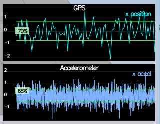
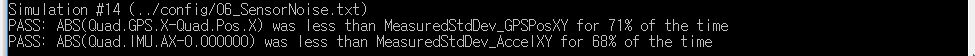

#### 2. Implement a better rate gyro attitude integration scheme in the UpdateFromIMU() function.
The improved integration scheme should result in an attitude estimator of < 0.1 rad for each of the Euler angles for a duration of at least 3 seconds during the simulation. The integration scheme should use quaternions to improve performance over the current simple integration scheme.

I used the Quaternion<float> class, which has a handy FromEuler123_RPY function for creating a quaternion from Euler Roll/PitchYaw. I used an IntegrateBodyRate function to integrate the body rates into new Euler angles.
The results are as follows:

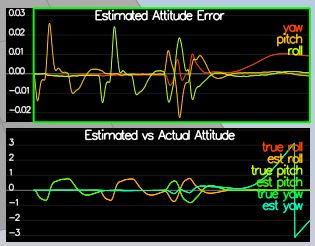
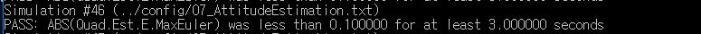

#### 3. Implement all of the elements of the prediction step for the estimator.
The prediction step should include the state update element (PredictState() function), a correct calculation of the Rgb prime matrix, and a proper update of the state covariance. The acceleration should be accounted for as a command in the calculation of gPrime. The covariance update should follow the classic EKF update equation.

I implemented the state prediction step in the PredictState() function in QuadEstimaterEKF.cpp.
States can be calculated by using the following formula.

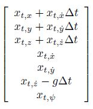

The result of the scenario 08_PredictState is as follows:

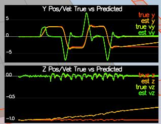

I implemented RbgPrime() function to calculate the partial derivative of the body-to-global rotation matrix. The following formula are used for that purpose.
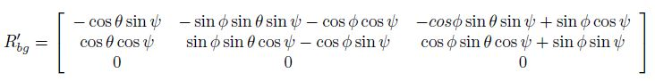

I implemented Predict() function to predict the current covariance forwad by dt using the current accelerations and body rates as input. The Jacobian function is as follows:
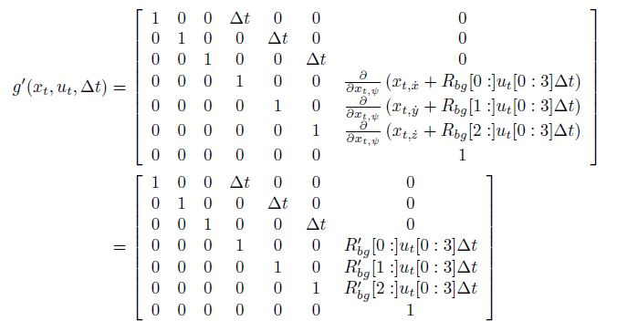

Finally, I tuned the QPosXYStd and the QVelXYStd process parameters in QuadEstimatorEKF.txt.
- QPosXYStd = .03
- QVelXYStd = .13

By using those parameters, I could get the following good results.

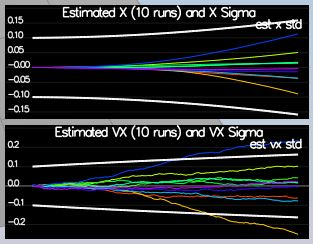

#### 4. Implement the magnetometer update.
The update should properly include the magnetometer data into the state. Note that the solution should make sure to correctly measure the angle error between the current state and the magnetometer value (error should be the short way around, not the long way).

Since this model is linear, the derivative is a matrix of zeros and ones.

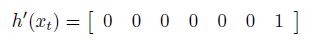

The current estimated yaw can be found in the state vector ekfState(6). I normalized the difference between the measured and estimated yaw.
I tuned the paramter QYawStd for the QuadEstimatorEKF so that it approximately captures the magnitude of the drift as follows:
- QYawStd = .15
The results are as follows:

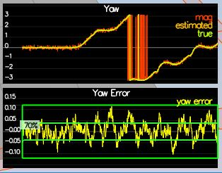
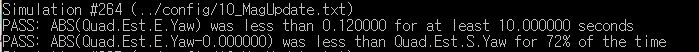

#### 5. Implement the GPS update.
The estimator should correctly incorporate the GPS information to update the current state estimate.

The partial derivative is the identity matrix, augmented with a vector of zeros.
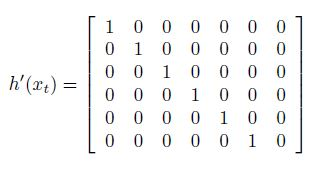

The results are as follows:

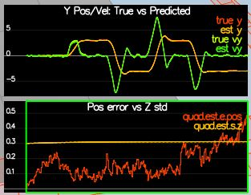
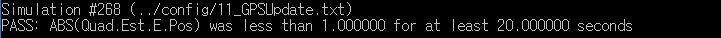

### Flight Evaluation
#### 1. Meet the performance criteria of each step.
For each step of the project, the final estimator should be able to successfully meet the performance criteria with the controller provided. The estimator's parameters should be properly adjusted to satisfy each of the performance criteria elements.

The performance criteria for each step of the project are successfully met. The estimator's parameters are properly adjusted.

#### 2. De-tune your controller to successfully fly the final desired box trajectory with your estimator and realistic sensors.
The controller developed in the previous project should be de-tuned to successfully meet the performance criteria of the final scenario (<1m error for entire box flight).

My de-tuned controller can successflly fly the final desired box trajectory with my estimator and realistic sensors.
